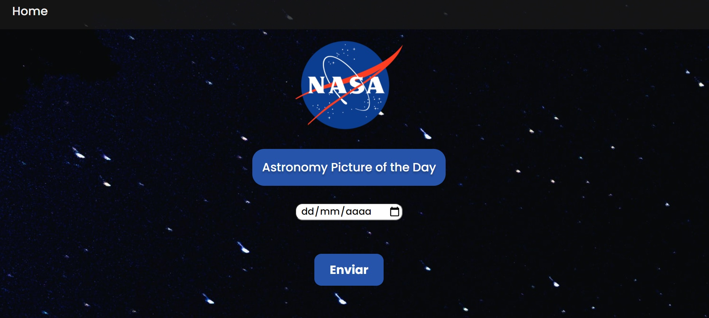
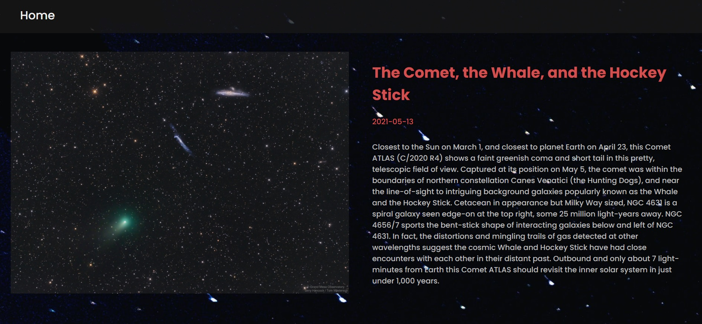

<p align="center">
  
</p>


  <h3 align="center">Nasa Astronomy Picture of the Day</h3>

  <p align="center">
    This app displays beautiful astronomy photos for the current day and month from the NASA APOD API
    <br />
    <br />
    <br />
  </p>
</p>


<!-- TABLE OF CONTENTS -->
<details open="open">
  <summary>Table of Contents</summary>
  <ol>
    <li>
      <a href="#about-the-project">About The Project</a>
      <ul>
        <li><a href="#built-with">Built With</a></li>
      </ul>
    </li>
    <li>
      <a href="#getting-started">Getting Started</a>
      <ul>
        <li><a href="#prerequisites">Prerequisites</a></li>
        <li><a href="#installation">Installation</a></li>
      </ul>
    </li>
    <li><a href="#usage">Usage</a></li>
    <li><a href="#contributing">Contributing</a></li>
    <li><a href="#contact">Contact</a></li>
  </ol>
</details>


<!-- ABOUT THE PROJECT -->
## About The Project

<p align="center">
  
</p>


This is a project that brings together API consumption knowledge through ReactJS. The Github API provides a lot of information that can be used for apps like this. The focus of the App was the training of API consumption, however it is fully functional.

Here's why:
* Training of API consumption throught ReactJS projects


A list of commonly used resources that I find helpful.

### Built With

This project was made using the following technologies
* [ReactJS](https://reactjs.org)
* [Axios](https://github.com/axios/axios)


<!-- GETTING STARTED -->
## Getting Started

Here are some instructions on setting up your project locally.
To get a local copy up and running follow these simple steps.

### Prerequisites

This is an example of how to list things you need to use the software and how to install them.
* npm
  ```sh
  npm install npm@latest -g
  ```

### Installation

1. Clone the repo
   ```sh
   git clone https://github.com/GersonST/repos.git
   ```
2. Install Axios
   ```sh
   npm install axios
   ```
3. Run the project 
   ```sh
   npm start
   ```


<!-- USAGE EXAMPLES -->
## Usage

You can search directly and more visually about Issues from the repositories.

<p align="center">
  
</p>


<!-- CONTACT -->
## Contact

# Gerson Severo
Email - gersonsevero90@gmail.com  

Instagram - https://www.instagram.com/gersonsevero_/

Project Link: [https://github.com/GersonST/repos](https://github.com/GersonST/repos)
